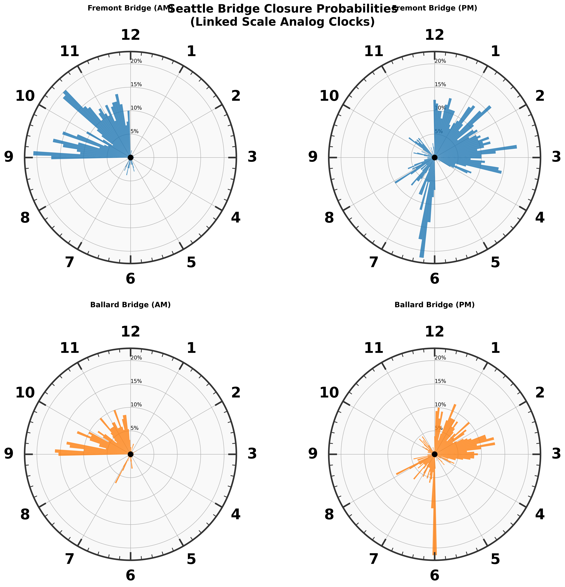
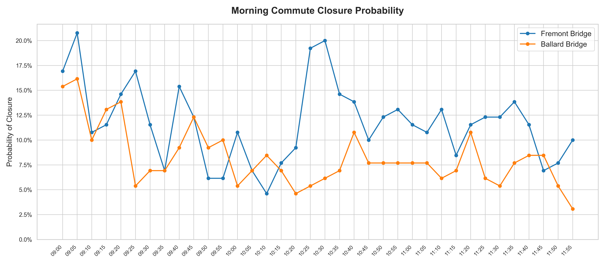
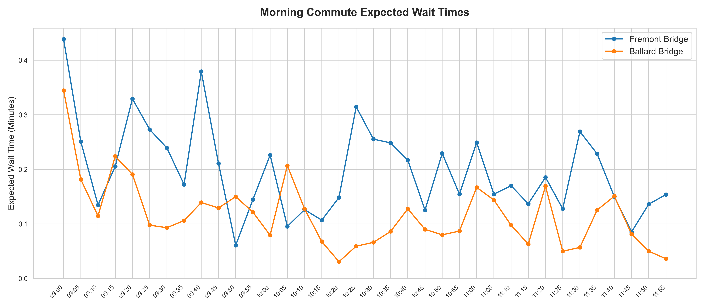
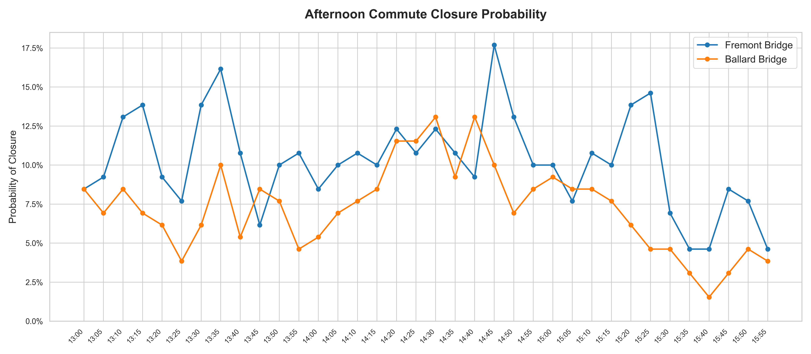
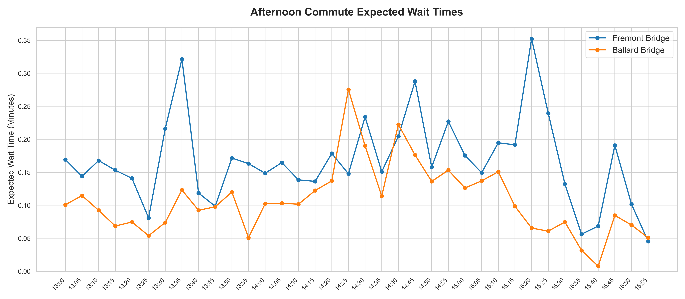
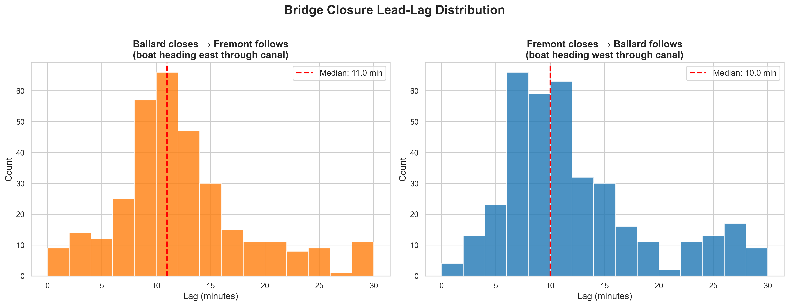

# Seattle Bridge Commute Analysis

**Which bridge should I take — and when should I leave?**

A data-driven analysis of Fremont vs. Ballard drawbridge closure patterns, built from 130 active weekdays of historical closure logs. All durations are capped at the 95th percentile (10 minutes) to prevent rare extreme events from distorting results.

## Why Expected Wait Time?

Closure probability alone doesn't tell the full story. Two bridges can have identical probabilities of being closed at a given time, but wildly different expected delays. This happens because:

1. **Duration matters**: A bridge that closes for 3 minutes has a very different impact than one that closes for 10 minutes, even if both close at the same frequency.
2. **Timing within the bin matters**: If a closure *just started*, you'll wait the full duration. If it's almost over, you'll barely wait at all.

Expected Wait Time captures both effects by computing the exact integral of wait time across each 5-minute bin, averaged over all historical weekdays — including the ~90% of days where no closure occurred (wait = 0). This gives the true mathematical expectation of delay for a commuter arriving at a random moment.

## Overall Closure Duration (All Times of Day)

Before looking at specific commute windows, here are the aggregate closure statistics across all weekday events:

| Bridge | Total Events | Mean Duration | Median Duration |
|---|---|---|---|
| **Fremont** | 876 | 5.4 min | 5.0 min |
| **Ballard** | 706 | 4.9 min | 5.0 min |

Fremont closes more often (24% more events) and its closures last slightly longer on average. This compounding effect — higher frequency × longer duration — is exactly why Fremont consistently produces higher expected wait times across both commute windows.

---

# Part 1: The Big Picture (24-Hour Clock View)

Before diving into specific commute windows, here is the full 24-hour closure probability for both bridges, rendered as analog clock faces. Each radial bar represents the probability of encountering a closed bridge during that 5-minute interval.

### Key Takeaways from the Clocks
- **Both bridges are virtually silent before 9 AM and after 4 PM** — maritime traffic is concentrated in the midday hours
- **Fremont's AM distribution is wider and taller** than Ballard's, indicating both higher frequency and longer-spreading closures
- **The PM patterns are more similar** between the two bridges, though Fremont still edges higher

---

# Part 2: Morning Commute (9 AM – 11 AM)

## The Verdict: Take Ballard 🏆

| Metric | Fremont | Ballard | Winner |
|---|---|---|---|
| **Avg Closure Probability** | 12.1% | 8.6% | **Ballard (29% lower)** |
| **Avg Expected Wait** | 0.21 min | 0.13 min | **Ballard (41% lower)** |

Ballard wins **19 out of 24** five-minute time bins on closure probability.

### Best and Worst Departure Windows

| Bridge | 🟢 Safest Window | Avg Prob | 🔴 Worst Window | Avg Prob |
|---|---|---|---|---|
| **Ballard** | **10:10 – 10:35** | **5.9%** | 9:00 – 9:25 | 12.3% |
| Fremont | 9:50 – 10:15 | 6.9% | 9:00 – 9:25 | 15.3% |

> ⚠️ Both bridges are at their worst during the **9:00 – 9:25 AM** window. Delay by 50 minutes to cut your risk in half.

### Closure Probability by Time

### Expected Wait Time

### Full Morning Breakdown

| Time | Fremont P | Ballard P | Fremont E[Wait] | Ballard E[Wait] | Better Bridge |
|------|-----------|-----------|-----------------|-----------------|---------------|
| 09:00 | 16.9% | 15.4% | 0.44m | 0.34m | Ballard |
| 09:05 | 20.8% | 16.2% | 0.25m | 0.18m | Ballard |
| 09:10 | 10.8% | 10.0% | 0.13m | 0.11m | Ballard |
| 09:15 | 11.5% | 13.1% | 0.21m | 0.22m | Fremont |
| 09:20 | 14.6% | 13.8% | 0.33m | 0.19m | Ballard |
| 09:25 | 16.9% | 5.4% | 0.27m | 0.10m | Ballard |
| 09:30 | 11.5% | 6.9% | 0.24m | 0.09m | Ballard |
| 09:35 | 6.9% | 6.9% | 0.17m | 0.11m | Tie |
| 09:40 | 15.4% | 9.2% | 0.38m | 0.14m | Ballard |
| 09:45 | 12.3% | 12.3% | 0.21m | 0.13m | Tie |
| 09:50 | 6.2% | 9.2% | 0.06m | 0.15m | Fremont |
| 09:55 | 5.4% | 10.0% | 0.14m | 0.12m | Fremont |
| 10:00 | 10.8% | 5.4% | 0.23m | 0.08m | Ballard |
| 10:05 | 6.9% | 6.9% | 0.10m | 0.21m | Tie |
| 10:10 | 4.6% | 8.5% | 0.13m | 0.13m | Fremont |
| 10:15 | 7.7% | 6.9% | 0.11m | 0.07m | Ballard |
| 10:20 | 9.2% | 3.8% | 0.15m | 0.03m | Ballard |
| 10:25 | 19.2% | 4.6% | 0.31m | 0.06m | Ballard |
| 10:30 | 20.0% | 5.4% | 0.26m | 0.07m | Ballard |
| 10:35 | 14.6% | 6.2% | 0.25m | 0.09m | Ballard |
| 10:40 | 13.8% | 10.0% | 0.22m | 0.13m | Ballard |
| 10:45 | 10.0% | 6.9% | 0.13m | 0.09m | Ballard |
| 10:50 | 11.5% | 6.9% | 0.23m | 0.08m | Ballard |
| 10:55 | 12.3% | 6.9% | 0.15m | 0.09m | Ballard |

---

# Part 3: Afternoon Commute Home (1 PM – 4 PM)

## The Verdict: Ballard Wins Again 🏆

| Metric | Fremont | Ballard | Winner |
|---|---|---|---|
| **Avg Closure Probability** | 10.2% | 7.2% | **Ballard (29% lower)** |
| **Avg Expected Wait** | 0.17 min | 0.11 min | **Ballard (36% lower)** |

Ballard wins **31 out of 36** time bins on probability.

### Best and Worst Departure Windows

| Bridge | 🟢 Safest Window | Avg Prob | 🔴 Worst Window | Avg Prob |
|---|---|---|---|---|
| **Ballard** | **3:30 – 3:55 PM** | **3.5%** | 2:20 – 2:45 PM | 11.4% |
| Fremont | 3:30 – 3:55 PM | 6.2% | 1:10 – 1:35 PM | 12.3% |

> ⚠️ Fremont's worst window is **1:10 – 1:35 PM** (12.3%) while Ballard's worst is **2:20 – 2:45 PM** (11.4%). Both converge on **3:30 – 3:55 PM** as the safest slot — but Ballard is nearly half the risk of Fremont even then.

> 💡 If you can push your departure to after 3:30 PM, Ballard drops to just 3.5% average closure probability — essentially risk-free.

### Closure Probability by Time

### Expected Wait Time

### Full Afternoon Breakdown

| Time | Fremont P | Ballard P | Fremont E[Wait] | Ballard E[Wait] | Better Bridge |
|------|-----------|-----------|-----------------|-----------------|---------------|
| 13:00 | 8.5% | 8.5% | 0.17m | 0.10m | Tie |
| 13:05 | 9.2% | 6.9% | 0.14m | 0.11m | Ballard |
| 13:10 | 13.1% | 8.5% | 0.17m | 0.09m | Ballard |
| 13:15 | 13.8% | 6.9% | 0.15m | 0.07m | Ballard |
| 13:20 | 9.2% | 6.2% | 0.14m | 0.07m | Ballard |
| 13:25 | 7.7% | 3.8% | 0.08m | 0.05m | Ballard |
| 13:30 | 13.8% | 6.2% | 0.22m | 0.07m | Ballard |
| 13:35 | 16.2% | 10.0% | 0.32m | 0.12m | Ballard |
| 13:40 | 10.8% | 5.4% | 0.12m | 0.09m | Ballard |
| 13:45 | 6.2% | 8.5% | 0.10m | 0.10m | Fremont |
| 13:50 | 10.0% | 7.7% | 0.17m | 0.12m | Ballard |
| 13:55 | 10.8% | 4.6% | 0.16m | 0.05m | Ballard |
| 14:00 | 8.5% | 5.4% | 0.15m | 0.10m | Ballard |
| 14:05 | 10.0% | 6.9% | 0.16m | 0.10m | Ballard |
| 14:10 | 10.8% | 7.7% | 0.14m | 0.10m | Ballard |
| 14:15 | 10.0% | 8.5% | 0.14m | 0.12m | Ballard |
| 14:20 | 12.3% | 11.5% | 0.18m | 0.14m | Ballard |
| 14:25 | 10.8% | 11.5% | 0.15m | 0.28m | Fremont |
| 14:30 | 12.3% | 13.1% | 0.23m | 0.19m | Fremont |
| 14:35 | 10.8% | 9.2% | 0.15m | 0.11m | Ballard |
| 14:40 | 9.2% | 13.1% | 0.20m | 0.22m | Fremont |
| 14:45 | 17.7% | 10.0% | 0.29m | 0.18m | Ballard |
| 14:50 | 13.1% | 6.9% | 0.16m | 0.14m | Ballard |
| 14:55 | 10.0% | 8.5% | 0.23m | 0.15m | Ballard |
| 15:00 | 10.0% | 9.2% | 0.18m | 0.13m | Ballard |
| 15:05 | 7.7% | 8.5% | 0.15m | 0.14m | Fremont |
| 15:10 | 10.8% | 8.5% | 0.19m | 0.15m | Ballard |
| 15:15 | 10.0% | 7.7% | 0.19m | 0.10m | Ballard |
| 15:20 | 13.8% | 6.2% | 0.35m | 0.07m | Ballard |
| 15:25 | 14.6% | 4.6% | 0.24m | 0.06m | Ballard |
| 15:30 | 6.9% | 4.6% | 0.13m | 0.07m | Ballard |
| 15:35 | 4.6% | 3.1% | 0.06m | 0.03m | Ballard |
| 15:40 | 4.6% | 1.5% | 0.07m | 0.01m | Ballard |
| 15:45 | 8.5% | 3.1% | 0.19m | 0.08m | Ballard |
| 15:50 | 7.7% | 4.6% | 0.10m | 0.07m | Ballard |
| 15:55 | 4.6% | 3.8% | 0.05m | 0.05m | Ballard |

---

# Part 4: Cross-Bridge Correlation

Since both bridges span the same Ship Canal, a boat passing through Ballard will typically reach Fremont ~10 minutes later (and vice versa). This creates a "convoy effect" that has major implications for commuters considering rerouting.

## Same-Day Co-Occurrence

| Scenario | Days | % of Active Weekdays |
|---|---|---|
| **Both bridges closed** | 125 | 96.2% |
| Only Fremont closed | 4 | 3.1% |
| Only Ballard closed | 0 | 0.0% |
| Neither closed | 1 | 0.8% |

On **96% of weekdays, both bridges close at least once**. There is not a single day in the dataset where Ballard closed without Fremont also closing. The bridges are not independent — they share the same maritime traffic.

## The Convoy Effect

When one bridge closes, how often does the other follow?

| Direction | Events | % of Closures | Median Lag |
|---|---|---|---|
| **Ballard → Fremont** (boat heading east) | 326 | 46.2% | 11 min |
| **Fremont → Ballard** (boat heading west) | 369 | 42.1% | 10 min |

Nearly half of all closures at one bridge are followed by a closure at the other bridge within 30 minutes. The median lag of 10–11 minutes is consistent with the Ship Canal transit time between the two bridges.

## Can You Hedge by Rerouting?

If you see Ballard go up and think "I'll reroute to Fremont," here's the probability Fremont is also going up:

| Time Window After Ballard Closes | P(Fremont Also Closes) |
|---|---|
| Within 5 min | 5.0% |
| Within 10 min | 22.0% |
| Within 15 min | 36.8% |
| Within 20 min | 41.2% |
| Within 30 min | 46.2% |

**The rerouting strategy doesn't work.** By the time you've rerouted (~15 min detour), there's a 37% chance the same boat has already reached the other bridge. This strengthens the case for simply choosing the bridge with the lower baseline probability (Ballard) and sticking with it.

---

# Summary

| | Morning (9–11 AM) | Afternoon (1–4 PM) |
|---|---|---|
| **Best Bridge** | Ballard | Ballard |
| **Best Time (Ballard)** | 10:10 – 10:35 (5.9%) | 3:30 – 3:55 (3.5%) |
| **Worst Time (Either)** | 9:00 – 9:25 (12–15%) | 1:10 – 2:45 (11–12%) |
| **Risk Reduction** | Ballard is 29% safer | Ballard is 29% safer |

**Bottom line: Always take Ballard.** The only scenario where Fremont is marginally better is a handful of scattered 5-minute windows — never enough to justify the overall higher risk profile.

---

## Methodology

For full details on the probability calculation logic, outlier treatment (P95 Winsorization), active-days denominator, confidence intervals, and the continuous integral expected wait time formula, see [PROBABILITY_README.md](PROBABILITY_README.md).
