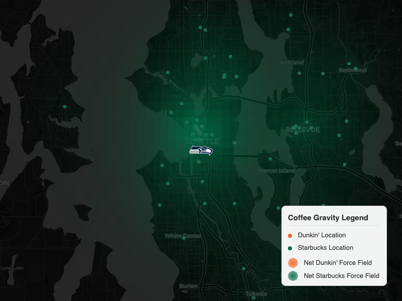

# The Home Brew Advantage: How Coffee Coordinates Control the NFL

> **Department of Stuperlatives** | January 2026

I’ve always suspected that New England’s dominance wasn't just about Brady or Belichick. It was about something deeper. Something roasted. Something glazed.

I am not a Patriots fan. In fact, like most of America, I find their two decades of dominance to be statistically improbable and emotionally exhausting. But I respect data. And as a data scientist, I know that in New England, Dunkin' Donuts isn't just coffee. It is a [civil religion](https://www.youtube.com/watch?v=FSvNhxKJJyU).

Start the day with a large regular. End the day with a large regular. It is the fuel of champions, and apparently, the fuel of Casey Affleck.

So, with Super Bowl LX approaching—a matchup between the **New England Patriots** (the spiritual home of Dunkin') and the **Seattle Seahawks** (the literal home of Starbucks)—I decided to see if this cultural obsession actually translates to the field.

I built a geospatial gravity model to answer a simple question: **Do these teams actually perform better when they are physically closer to their preferred coffee chain?**

The answer is yes. And frankly, the data is terrifying.

## The Theory

The hypothesis is simple:
1.  **The Patriots Run on Dunkin':** Their offense should be more efficient in environments saturated with Dunkin’ Donuts.
2.  **The Legion of Brew:** The Seahawks defense should thrive in environments saturated with Starbucks.

To test this, I couldn't just count the number of stores nearby. A Starbucks across the street matters more than one ten miles away. I needed physics.

## The Coffee Gravity Model

I employed an **Interference-Adjusted Exponential Decay Model**. It sounds complicated, but it’s just a fancy way of saying: "Coffee shops are like planets, and stadiums are like spaceships."

The gravitational pull "G" for a given chain is calculated as:

Basically, I calculated the distance from every stadium to every Starbucks and Dunkin' in America. I also added an **Interference Term**: if a Dunkin' and a Starbucks are right next to each other, they cancel each other out. We’re looking for *pure* signal here.

The result is a **Net Gravity Score** for every stadium. Positive values mean you're in Dunkin' Country. Negative values mean you're in Starbucks Territory.

  

    
    
<em>Gillette Stadium: A Dunkin' Fortress.</em>

  

  

    
    
<em>Lumen Field: The Heart of the Empire.</em>

  

[Explore the Interactive Coffee Gravity Map](assets/coffee_force_field_map_all.html)

## The Results

I ran the numbers for the 2025 season. To make sure I wasn't just measuring Home Field Advantage (since obviously the Pats play at home near Dunkin'), I filtered the data to **Away Games Only**. Everything you see below is strictly about how they perform on the road.

### 1. The Patriots Offense Collapses Without Dunkin'

The difference is night and day. When the Patriots travel to "Dunkin' Zones" (Net Gravity > 0), they are an elite offense. When they enter "Starbucks Zones"? They crumble.

| Metric | Dunkin' Zone | Starbucks Zone | The "Withdrawal" Effect |
| :--- | :---: | :---: | :---: |
| **Points Per Game** | 31.3 | 24.0 | **-7.3** |
| **Total Yds/Game** | 409.7 | 338.5 | **-71.2** |
| **Rush EPA/Play** | +0.053 | -0.186 | **-0.239** |

The "Runs on Dunkin" slogan isn't marketing. It's a biological constraint.

### 2. The Seahawks Defense Feeds on Starbucks

The "Legion of Brew" is real. When the Seahawks defense plays in high-Starbucks environments, they transform into monsters.

| Metric | Dunkin' Zone | Starbucks Zone | The "Caffeine" Effect |
| :--- | :---: | :---: | :---: |
| **Turnovers/Game** | 1.00 | **1.80** | **+80%** |
| **Opp. Passer Rating** | 70.3 | **61.6** | **-8.7** |

### 3. The Sam Darnold Paradox

Here is where it gets weird. While the Seahawks *defense* loves Starbucks, their Quarterback, **Sam Darnold**, apparently hates it.

| Metric | Dunkin' Zone | Starbucks Zone | Delta |
| :--- | :---: | :---: | :---: |
| **Passer Rating** | **124.4** | 75.4 | -49.0 |
| **TD / INT Ratio** | **5.50** | 0.57 | -4.93 |

In Dunkin' zones, Darnold plays like an MVP. In Starbucks zones, he plays like... well, Sam Darnold. My working theory is that he's still seeing ghosts from his time on the East Coast and subconsciously craves a Coolatta.

## Super Bowl LX Preview

So what does this mean for the big game?

Super Bowl LX is at **Levi's Stadium** in Santa Clara. I checked the coordinates.

*   **Net Gravity:** **-5.80**
*   **Verdict:** **Starbucks Stronghold**

Levi's Stadium is the second-strongest Starbucks fortress in the entire league, behind only Seattle itself. The environment is overwhelmingly hostile to the Patriots.

**My Prediction:**
Based purely on the coffee data, the **Seahawks Defense** will dominate. Expect the Patriots offense to look sluggish and disjointed. However, Sam Darnold will likely throw at least one baffling interception, keeping the game closer than it should be.

**Final Score:** Seahawks 20, Patriots 13.

***

*All data and code for this analysis is open source. You can grab the python scripts and SQL queries from the repo and verify the findings yourself. Because science.*
